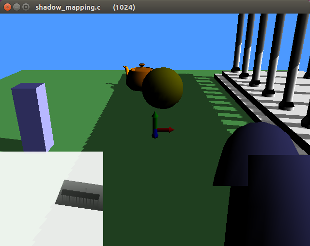
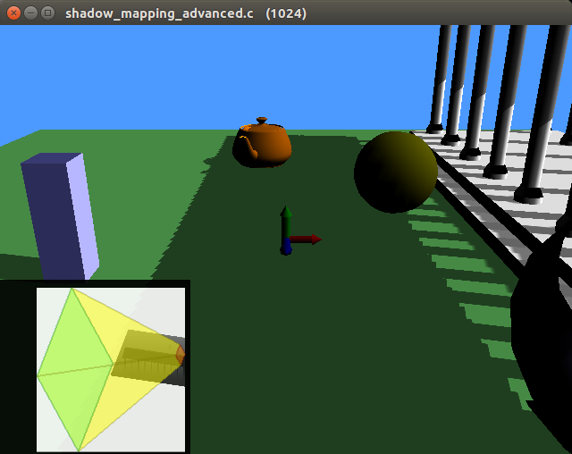
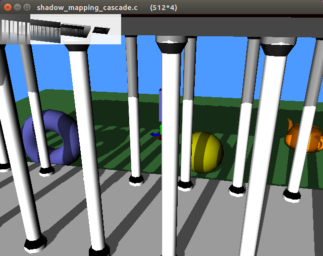
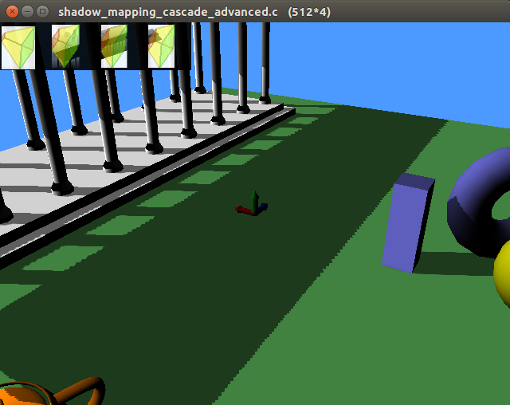
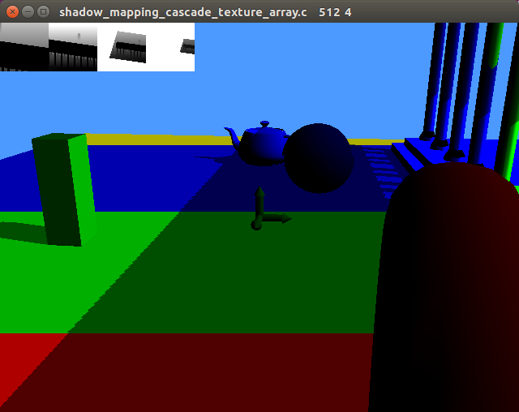
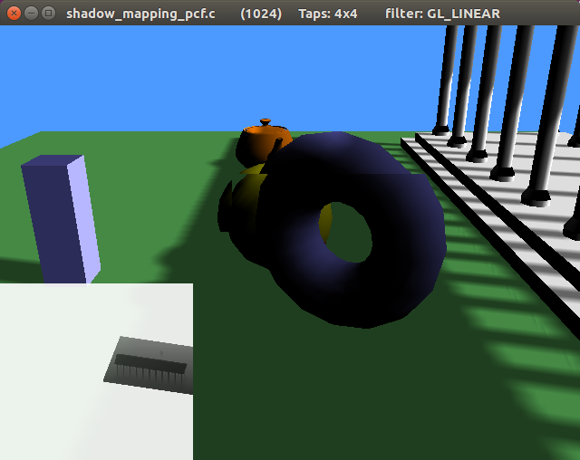
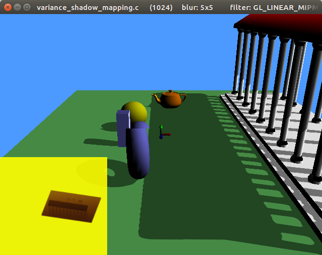
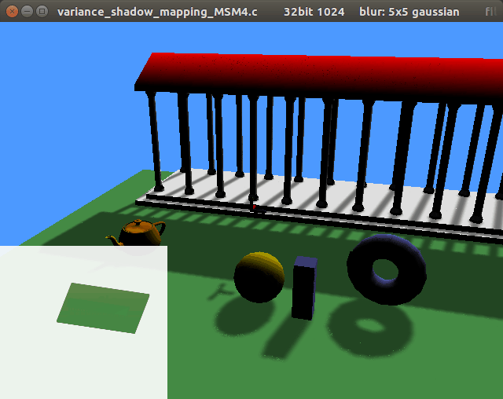
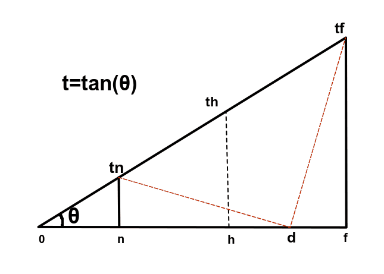

# Tiny-OpenGL-Shadow-Mapping-Examples
Compact OpenGL Shadow Mapping Examples in a single compilation unit.

## Features
* A single .c file per example.
* No extern math library used. No math structs used. Just plain float arrays.
* Helper functions (mainly math stuff) grouped in the header helper_functions.h, for easier inclusion into user code.
* Only a single directional light is used in all the examples.
* Currently all the examples are flicker-free while the camera moves and rotates (on static objects). Please see the implementation section below for further info.

## Dependencies
* glut (or freeglut)
* glew (Windows only)

## How to compile
Compilation instructions are at the top of each .c file.
All the demos have been tested on Linux using an **NVIDIA graphic card** (AMD/ATI might need some glsl tweaking).

## Help needed
The demos: shadow_mapping_sESM1.c, variance_shadow_mapping.c, variance_shadow_mapping_EVSM2.c and variance_shadow_mapping_EVSM4.c are all **WRONG**! The shadows should look blurry and instead are sharp! If you can help to fix these (and other) issues, please post a message in the *"Issues"* or *"Pull requests"* sections. Thank you in advance!

## Screenshots

## Implmentation
All the examples in this repository implement "Stable Shadow Mapping".
That means that static shadows should not flicker when the camera moves or rotates, at the expense of the shadow resolution, that is usually only a half of the resolution that can be used in any "Non-Stable Shadow Mapping" technique.
In addition, the light matrices calculated by the "Stable Shadow Mapping" algorithm are not optimal for frustum culling usage, and if we want to filter the shadow map (like in VSM), we waste a lot of resources, unless we manage to calculate a tighter texture viewport somehow (we address this issue in **shadow_mapping_advanced.c** and  **shadow_mapping_cascade_advanced.c**).

The "Stable Shadow Mapping" algorithm calculates the minimum sphere that encloses the camera frustum, and further encloses it in a light ortho projection matrix.

### Calculation of the camera frustum center and radius
The picture below is valid for every frustum field of view (fovx, fovy and fovd), but if we use the diagonal fov, then the points at **tn** and **tf** are real frustum corners.
(**n** is the near camera frustum clipping plane and **f** is the far camera frustum clipping plane)

<pre>
θ = (fovd/2);   // half diagonal fov
t = tan(θ);
tSquared = (1.0+ar*ar)*tan(0.5*fovy)*tan(0.5*fovy); // ar = camera aspect ratio
h = 0.5*(f+n) ;  // half way between near and far plane
d = h*(1.0+tSquared);   // Found after all the math passages from the picture above
if (d>f) d=f;           // Clamping to save some shadow resolution
r = sqrt((tSquared*f*f) + (f-d)*(f-d));
</pre>

## Useful Links
[opengl-cascaded-shadow-maps with code at the bottom](https://johanmedestrom.wordpress.com/2016/03/18/opengl-cascaded-shadow-maps/)

[graphics-tech-shadow-maps-part-1 (explains why shadow resolution gets wasted)](http://the-witness.net/news/2010/03/graphics-tech-shadow-maps-part-1/)

[graphics-tech-shadow-maps-part-2 (proposes a method to save GPU memory)](http://the-witness.net/news/2010/04/graphics-tech-shadow-maps-part-2-save-25-texture-memory-and-possibly-much-more/)

[A sampling of shadow techniques](https://mynameismjp.wordpress.com/2013/09/10/shadow-maps/)

[GPU Gems 3 - Chapter 10. Parallel-Split Shadow Maps on Programmable GPUs](https://developer.nvidia.com/gpugems/GPUGems3/gpugems3_ch10.html)

[variance_shadow_mapping.c is greatly based on this Fabien Sanglard's work](http://fabiensanglard.net/shadowmappingVSM/)

[glsl-fast-gaussian-blur: my blur filters are based on this Github repository](https://github.com/Jam3/glsl-fast-gaussian-blur/)

[Github repository containing Direct3D implementations of many modern shadow mapping techniques](https://github.com/TheRealMJP/Shadows)

